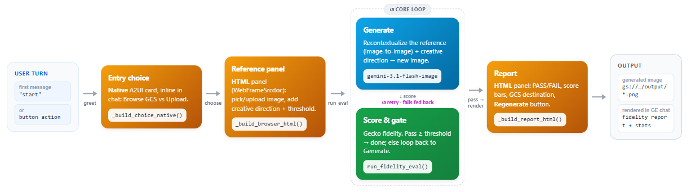

# a2ui_omni — A2UI Product-Fidelity Agent

This repository demonstrates the [product-fidelity-eval](https://github.com/behardja/product-fidelity-eval) framework fronted by **A2UI**, a declarative UI protocol that lets an agent return interactive widgets instead of plain text. A user browses a product reference image from Cloud Storage (or uploads one), optionally adds a line of creative direction, and the agent runs the Gecko fidelity-eval loop and renders the results — reference vs. candidate images, pass/fail status, scores, and rubric verdicts — as A2UI cards the browser draws directly.

The same eval engine as `product-fidelity-eval` (describe → generate → Gecko score → threshold → retry) drives the loop; the difference here is the presentation layer: the agent emits **A2UI v0.8** over **A2A**, matching Gemini Enterprise's built-in renderer.


## How it works



The agent runs one loop per evaluation:

1. **Describe** — Gemini generates a ground-truth description of the product from the reference image.
2. **Generate** — the reference image plus that description plus your optional creative direction are sent to the image model, which recontextualizes the *same* product into a new scene (e.g. "a model posing on a rooftop bar") while keeping the product's design, colors, and pattern intact.
3. **Evaluate** — Gecko scores the candidate against the description and returns per-attribute passing/failing verdicts.
4. **Threshold & retry** — if the score is below the passing threshold, the loop retries (up to N attempts), emphasizing the attributes that failed.
5. **Render** — the agent turns the result into A2UI, which the renderer draws as a "Fidelity Report" card.

## Models

| Role | Model | Endpoint |
|------|-------|----------|
| Orchestrator + description | `gemini-3.5-flash` | `global` |
| Image generation (default) | `gemini-3.1-flash-image` (Nano Banana 2) | `global` |
| Image generation (options) | `gemini-3.1-flash-lite-image` (fast/cheap) · `gemini-3-pro-image` (highest quality) | `global` |
| Fidelity scoring | Gecko rubric metric | `us-central1` |

The image model is selectable from a dropdown in the UI; the Gemini 3.x models are served on the `global` endpoint (they 404 on regional endpoints), while the Gecko eval service is regional.

## Prerequisites

Ensure the project environment, network settings, and service account have the appropriate Google Cloud authentication and permissions to access:

- **Vertex AI API**
- **Cloud Storage API**

**Runtime requirements:**

- Python 3.10+
- Node.js v18+ (renderer only)
- Google Cloud authentication (e.g. `gcloud auth application-default login`)

## Getting Started

**1. Configure the environment:**

```bash
cp .env.example .env    # fill in PROJECT_ID, CANDIDATE_BUCKET, and model/threshold defaults
```

**2. Install dependencies:**

```bash
pip install -r requirements.txt
cd dev_client && npm install && cd ..
```

**3. Run the app:**

```bash
python server.py
```

`server.py` is a single launcher: it starts the agent A2A server (uvicorn + Starlette on `:10002`), builds and serves the renderer (Vite on `:5173`), and prints a clickable URL. The renderer proxies the browser's `/a2a` calls to the agent, so the browser only ever talks to one origin — no CORS.

**4. Using the app:**

1. Open the URL printed by `server.py`.
2. Choose **Browse GCS** (enter a `gs://` prefix and browse) or **Upload image**.
3. Optionally set a **passing threshold**, **max attempts**, and **image model** in the run config on the left, and add **creative direction** for the generated scene.
4. Click **Generate and Evaluate** and watch the progress; the Fidelity Report renders when the loop finishes.
5. Click **↺ New session** to clear the workflow and start fresh.

> **Note (headless VMs):** on a Vertex AI Workbench VM there is no display, so `server.py` also prints the authenticated Workbench proxy link (`https://<proxy-host>/proxy/5173/`) — use that. The raw external-IP link is included too, but it can drop the slow eval POST behind some networks; prefer the proxy link.

## Layout

| Path | Role |
|------|------|
| `server.py` | single launcher: agent A2A server + renderer, prints a clickable URL |
| `agent.py` | ADK agent; A2UI-aware system prompt (`A2uiSchemaManager` + few-shot `examples/0.8`) |
| `tools.py` | `list_gcs_images`, `ingest_uploaded_image_tool`, `get_eval_defaults`, `run_fidelity_eval` |
| `generate.py` | `generate_candidate_image` — the eval loop's generation plugin (recontextualize → GCS) |
| `executor.py` | A2A bridge: extracts `<a2ui-json>` → A2UI DataParts; maps `select_reference` / `run_eval` actions |
| `examples/0.8/` | few-shot A2UI exemplars: `gcs_browser`, `fidelity_result`, `settings_panel` |
| `evaluation_wrapper/` | vendored Gecko loop (`EvalPipeline` / `EvalConfig`) |
| `dev_client/` | A2UI **v0.9** renderer (built on `@a2ui/lit`) — renders on the `v0.9_a2ui` branch only; GE's own renderer draws the v0.8 output of this branch |
| `adk_app.py` | `adk web` / Agent Engine entry point |
| `__main__.py` | agent A2A server (`python -m a2ui_omni`, port 10002) |
| `deploy.py` | deploy to Agent Engine (runs as compute SA for signed URLs) + register on Gemini Enterprise with the A2UI extension & authorization |

## Deploy to Agent Engine + Gemini Enterprise

Set the deployment vars in `.env` and run `python deploy.py` (deploys to Vertex AI
Agent Engine and, when `GEMINI_ENTERPRISE_APP_ID` is set, registers the agent on
your Gemini Enterprise app).

**Prerequisites for Gemini Enterprise rendering** (beyond the runtime requirements
above) — the agent will deploy fine without these, but GE won't invoke or render it:

- **A GE Authorization Resource (OAuth) is required.** A "Custom agent via A2A"
  registration must have an `authorizationConfig.agentAuthorization` or GE blocks
  invocation entirely (chat shows "Something went wrong" and no request reaches the
  agent). This means: an OAuth 2.0 client + a Discovery Engine authorization
  resource, attached to the registration.
- **Signed-URL permission for images.** The deployed runtime SA must be able to
  mint V4 signed GCS URLs (`roles/iam.serviceAccountTokenCreator` on itself); the
  agent runs as the compute SA for this (`deploy.py` sets `service_account`).
- **A2UI version:** GE currently renders **v0.8** only (this branch targets it);
  see the note at the top.

## Future Work

- Surface the settings panel (creative direction, threshold, attempts) natively in the GE flow, since GE has no local shell.
- Add video generation/evaluation (Veo), as in `product-fidelity-eval`.
- Add a lifecycle rule or cleanup for accumulated candidate images in the GCS bucket.
- Adopt A2UI v0.9 for GE once GE GA supports it (merge from `v0.9_a2ui`).

## Reference

- [behardja/product-fidelity-eval](https://github.com/behardja/product-fidelity-eval) — the original framework this repository is based on (multi-agent ADK pipeline + React front-end). `a2ui_omni` reuses its evaluation engine and delivers it through an A2UI front-end.
</content>
